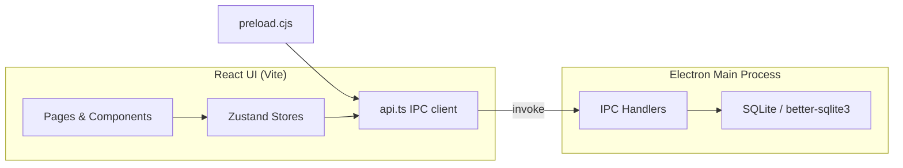

# HVAC ERP

**Offline desktop ERP built for HVAC contracting businesses** — manage projects, inventory, purchases, invoicing, payroll, and accounting from a single local application. No cloud required.

[](package.json)
[](https://www.electronjs.org/)
[](https://react.dev/)
[](https://www.typescriptlang.org/)
[](https://www.sqlite.org/)

---

## Overview

HVAC ERP is a full-featured business management system tailored to HVAC contractors. It runs entirely on your machine using a local SQLite database, making it ideal for shops that need reliable offline access, fast performance, and full control over their data.

From raw material stock and fabrication orders to project profitability and tax-ready invoices, every module shares the same ledger — so numbers stay consistent across the app.

## Features

### Operations
- **Dashboard** — receivables, payables, cash position, active projects, low-stock alerts, and recent activity
- **Projects** — quotations, material issue/return, labor tracking, site expenses, and profit & loss per project
- **Fabrication** — bills of materials and fabrication work orders linked to inventory

### Inventory & Procurement
- **Raw Materials & Finished Goods** — item catalog, warehouses, reorder levels, and stock valuation
- **Stock Movements** — full audit trail of inventory in/out
- **Purchases** — purchase orders, vendor invoices, and payment recording

### Sales & Finance
- **Customers & Vendors** — profiles, ledgers, aging, and balance tracking
- **Sales Invoices** — GST, further tax, discounts, withholding tax, and professional print/PDF output
- **Cash & Bank** — cash accounts, bank accounts, and transaction history
- **Accounting** — chart of accounts and double-entry journal entries
- **Expenses** — company and project expenses by category
- **HR & Payroll** — employees, salary runs, and project labor costs

### Reporting & Administration
- **Reports** — project profitability, receivables/payables aging, inventory valuation, low stock, GST, WHT, expense breakdown, and employee cost
- **Settings** — company profile, users, roles, inventory setup, activity log, backup & restore

### Security
- Session-based authentication with IPC token validation
- Role-based route guards (`admin`, `accountant`, `storekeeper`, `technician`, `viewer`)
- Password hashing with bcrypt
- Electron context isolation — renderer has no direct Node.js access

## Tech Stack

| Layer | Technology |
|-------|------------|
| Desktop shell | [Electron](https://www.electronjs.org/) 33 |
| UI | [React](https://react.dev/) 18 + [React Router](https://reactrouter.com/) |
| Build | [Vite](https://vitejs.dev/) 5 |
| Language | [TypeScript](https://www.typescriptlang.org/) |
| Database | [SQLite](https://www.sqlite.org/) via [better-sqlite3](https://github.com/WiseLibs/better-sqlite3) |
| Styling | [Tailwind CSS](https://tailwindcss.com/) |
| State | [Zustand](https://zustand-demo.pmnd.rs/) |
| Icons | [Lucide React](https://lucide.dev/) |

## Architecture



```
digital-invoicing/
├── electron/           # Main process, IPC handlers, database
│   ├── main.ts
│   ├── preload.ts
│   ├── database/       # schema.sql, migrations, seed data
│   └── ipc/            # auth, inventory, invoices, projects, reports, …
├── src/                # React frontend
│   ├── pages/          # Feature screens
│   ├── components/     # Shared UI
│   ├── store/          # Zustand state
│   └── lib/            # API layer, types, print templates
├── build/              # App icons for packaging
└── dist/               # Vite production build (generated)
```

## Getting Started

### Prerequisites

- **Node.js** 18 or later
- **npm** 9+
- **Windows** (primary packaging target; dev also works on macOS/Linux with Electron)

Native module rebuild runs automatically on `npm install` via `electron-builder install-app-deps`.

### Installation

```bash
git clone https://github.com/codewithdevsubtain/digital-invoicing.git
cd digital-invoicing
npm install
```

### Development

```bash
npm run dev
```

This compiles the Electron main/preload processes, starts the Vite dev server, and launches the **Electron desktop window**.

> **Important:** Use the Electron app window that opens — not the browser tab at `localhost:5173`. IPC features (login, database, printing) only work inside Electron.

### Production Build

```bash
npm run build
```

Output installer: `release/` (Windows NSIS). Place `build/icon.ico` before packaging — see [`build/README.md`](build/README.md).

### Other Scripts

| Command | Description |
|---------|-------------|
| `npm run compile` | Type-check and compile Electron + renderer TypeScript |
| `npm run vite:build` | Build frontend only |
| `npm run electron:build` | Package with electron-builder |
| `npm run lint` | Run ESLint |

## Default Login

On first launch, a default administrator account is created:

| Field | Value |
|-------|-------|
| Username | `admin` |
| Password | `admin123` |

You will be prompted to change the password on first login. **Change this immediately** before using the app in production.

## User Roles

| Role | Access |
|------|--------|
| **Admin** | Full access to all modules and settings |
| **Accountant** | Finance modules — vendors, customers, purchases, invoices, expenses, cash/bank, accounting, reports |
| **Storekeeper** | Inventory — raw materials, finished goods, stock movements, fabrication, purchases |
| **Technician** | Projects and HR & payroll |
| **Viewer** | Dashboard and reports (read-only) |

## Data & Backups

All business data is stored locally in the Electron user data directory as a SQLite database. Use **Settings → Data Management** to create backups and restore from a previous snapshot.

Database files (`.db`) are excluded from git — never commit live production data.

## Invoice & Quotation Printing

Sales invoices and project quotations support a print-ready layout with company branding, line items, GST summary, and notes. Configure your company name, logo, NTN, and address under **Settings**, then use **Print** from the invoice view or **Print Quotation** on a project.

## License

This project is licensed under the **MIT License** (see `package.json`).

---

Built for HVAC contractors who need a dependable, offline-first ERP without subscription fees or cloud lock-in.
